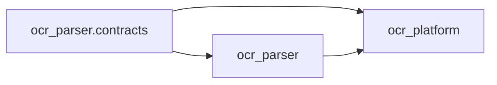

# Architecture and Source Governance

## Source of truth

The public OcrParser repository is the only source-code mainline. Internal
environments consume an immutable public tag or commit and keep only private
deployment configuration, credentials, and infrastructure adapters. An internal
checkout must never replace the public tree wholesale. Reusable internal changes
return through a focused pull request after data, endpoint, and credential review.

## Dependency direction

`ocr_parser` must not import `ocr_platform`. A static test enforces this rule.
Legacy platform manifest imports remain a v0.2 re-export so the JSONL wire format
does not change.

## Parser composition

`DotsOCRParser` is the compatibility façade. Its implementation is composed from:

- `ParserRuntime`: process pools, concurrency controls, inference client, metrics,
  cancellation, and lifecycle.
- `DocumentPipeline`: document/page orchestration and shared OCR post-processing.
- `InferenceRuntime`: API lanes, retry classification, and inference telemetry.
- `OutputManager`: Markdown, JSON, sidecars, images, and output auditing.
- `ResumePolicy`: resume and force-reprocess decisions.

Engines receive `ParserEngineContext`, not the parser façade. Engine-specific
branches are expressed as `EngineCapabilities`, including shared cross-page
post-processing, native artifacts, and layout-service requirements.

Engine execution metadata uses three neutral contracts:

- `StageOutcome` records a bounded stage name, outcome, optional failure category,
  and optional duration.
- `FallbackInfo` distinguishes a real degraded path from the legacy page status.
- `EngineExecutionTrace` carries both structures into page/file events, status
  sidecars, and artifact metadata.

The legacy `success_fallback_text` and `success_fallback_image` statuses remain
accepted through v0.3. Consumers should use `fallback.used`, `fallback.reason`,
and `fallback.source_stage` to distinguish normal two-stage completion from a
real fallback. Metrics normalize unknown engine, stage, failure, and fallback
values to `other` before using them as labels.

## Control domains

The Control application is a composition root: it owns lifecycle, middleware,
dependency wiring, router registration, and static assets. Business behavior is
split into six domains under `ocr_platform.control.domains`: jobs, workers,
manifests, model profiles, remote administration, and diagnostics. Each domain
owns its HTTP adapter, command/query surface, service implementation, and schema
conversion. ORM models remain centralized for v0.3.

The historical `ocr_platform.control.service` import path is a compatibility
façade for v0.3. New integrations must import the owning domain instead; the
5,000-line monolithic service module no longer exists.

## Agent runtime

The single-process agent is composed by `AgentRuntime`. `AgentSupervisor` owns
six named lanes: heartbeat, job polling, scan, shard execution, manifest
integrity, and spool/replay. It provides a shared signal, cancellation, retry,
and shutdown boundary; a lane cannot start after shutdown begins, and late
failure/replay results are not reported after that boundary.

## Compatibility boundary

v0.3 preserves CLI flags and exit codes, HTTP paths and schemas, migration history,
manifest JSONL, output directory layout, Markdown/JSON/sidecars, and top-level
`ParserConfig`, `DotsOCRParser`, and `DotsOCRParserOptimized` imports. Internal
modules, dynamic attributes, and semi-public helpers are not compatibility APIs.
