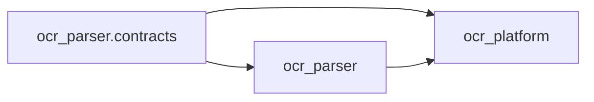

# 架构与源码治理

## 唯一源码主线

OcrParser 公开仓库是唯一源码主线。内网环境只消费公开仓库不可变的 tag 或
commit，并单独维护私有部署配置、凭据和基础设施适配。禁止用内网仓库整体覆盖
公开仓库；可复用的内网改动必须完成数据、地址和凭据脱敏后，通过小范围 PR 回流。

## 依赖方向

`ocr_parser` 不得导入 `ocr_platform`，静态测试会检查该边界。旧的 platform
manifest 导入路径在 v0.2 仍作为 re-export 保留，因此 JSONL wire format 不变。

## Parser 组合结构

`DotsOCRParser` 是兼容 façade，内部由以下组件组合：

- `ParserRuntime`：进程池、并发控制、推理客户端、指标、取消和生命周期；
- `DocumentPipeline`：文档/页面编排及共享 OCR 后处理；
- `InferenceRuntime`：API lane、重试分类和推理遥测；
- `OutputManager`：Markdown、JSON、sidecar、图片和输出审计；
- `ResumePolicy`：断点续跑和强制重处理策略。

引擎接收 `ParserEngineContext`，不再接收完整 Parser façade。共享跨页后处理、
原生产物和布局服务依赖由 `EngineCapabilities` 表达。

引擎执行元数据使用三个中立契约：

- `StageOutcome` 记录受控的阶段名、结果、可选失败类别和可选耗时；
- `FallbackInfo` 将真实降级路径与旧 page status 分离；
- `EngineExecutionTrace` 将两者传递到 page/file event、status sidecar 和产物元数据。

v0.3 继续兼容 `success_fallback_text` 和 `success_fallback_image`。消费者应使用
`fallback.used`、`fallback.reason` 和 `fallback.source_stage` 区分正常两阶段完成与
真实 fallback。指标写入 label 前会把未知 engine、stage、failure 和 fallback 值
统一归一化为 `other`。

## Control 业务域

Control application 现在只作为组合根，负责生命周期、middleware、依赖装配、
router 注册和静态资源。业务行为拆到 `ocr_platform.control.domains` 下的 jobs、
workers、manifests、model profiles、remote administration 和 diagnostics 六个域；
每个域拥有自己的 HTTP adapter、command/query、service 实现和 schema 转换。
v0.3 暂时继续集中维护 ORM models。

历史 `ocr_platform.control.service` 导入路径在 v0.3 作为兼容 façade 保留。新集成
应直接导入对应业务域；原有 5,000 行单体 service module 已删除。

## Agent runtime

单进程 agent 由 `AgentRuntime` 组合，`AgentSupervisor` 统一管理 heartbeat、job
polling、scan、shard execution、manifest integrity、spool/replay 六条命名 lane，
并提供共同的 signal、cancel、retry 和 shutdown 边界。shutdown 开始后不能启动
新 lane，也不会继续上报迟到的失败或 replay 结果。

## 兼容边界

v0.3 保持 CLI 参数和退出码、HTTP 路径和 schema、migration 历史、manifest
JSONL、输出目录、Markdown/JSON/sidecar，以及顶层 `ParserConfig`、
`DotsOCRParser`、`DotsOCRParserOptimized` 导入。内部模块、动态属性和半公开 helper
不属于兼容 API。
