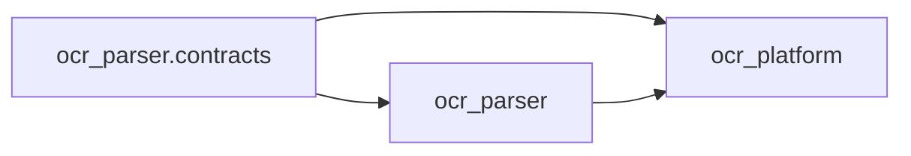

# 架构与源码治理

## 唯一源码主线

OcrParser 公开仓库是唯一源码主线。内网环境只消费公开仓库不可变的 tag 或
commit，并单独维护私有部署配置、凭据和基础设施适配。禁止用内网仓库整体覆盖
公开仓库；可复用的内网改动必须完成数据、地址和凭据脱敏后，通过小范围 PR 回流。

## 依赖方向

`ocr_parser` 不得导入 `ocr_platform`，静态测试会检查该边界。旧的 platform
manifest 导入路径在 v0.2 仍作为 re-export 保留，因此 JSONL wire format 不变。

## Parser 组合结构

`DotsOCRParser` 是兼容 façade，内部由以下组件组合：

- `ParserRuntime`：进程池、并发控制、推理客户端、指标、取消和生命周期；
- `DocumentPipeline`：文档/页面编排及共享 OCR 后处理；
- `InferenceRuntime`：API lane、重试分类和推理遥测；
- `OutputManager`：Markdown、JSON、sidecar、图片和输出审计；
- `ResumePolicy`：断点续跑和强制重处理策略。

引擎接收 `ParserEngineContext`，不再接收完整 Parser façade。共享跨页后处理、
原生产物和布局服务依赖由 `EngineCapabilities` 表达。

## 兼容边界

v0.2 保持 CLI 参数和退出码、HTTP 路径和 schema、migration 历史、manifest
JSONL、输出目录、Markdown/JSON/sidecar，以及顶层 `ParserConfig`、
`DotsOCRParser`、`DotsOCRParserOptimized` 导入。内部模块、动态属性和半公开 helper
不属于兼容 API。
