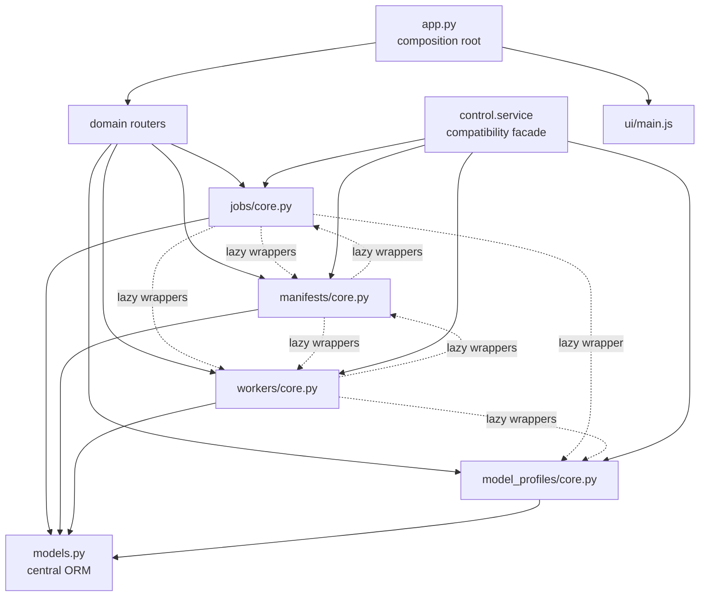
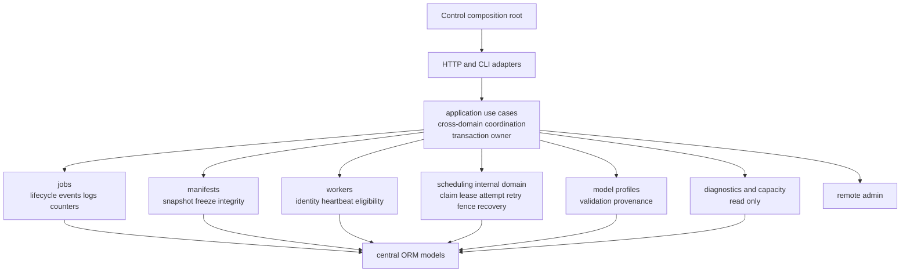

# Control Module Map

English | [中文](control-module-map.zh-CN.md)

Status: current audit snapshot and proposed v0.4 target. This document describes
ownership and migration; line counts are not acceptance targets.

Related: [Control Internals RFC](rfc-v0.4-control-internals.md)

## Current Shape



## Audit Snapshot

| Surface | Current evidence | Interpretation |
| --- | ---: | --- |
| `app.py` | 138 lines | already a composition root; not a decomposition target |
| `jobs/core.py` | 1,678 lines | lifecycle, summaries, events, logs, counters, and scheduling coordination are mixed |
| `manifests/core.py` | 2,100 lines | scan, freeze/integrity, shard scheduling, attempts, and recovery are mixed |
| `workers/core.py` | 1,059 lines | identity, heartbeat, eligibility, preflight, claim, lease, and recovery are mixed |
| `schemas.py` | 704 lines | shared schema surface needs compatibility locking before movement |
| `ui/main.js` | 3,268 lines | recorded debt; not implemented by the Control internals RFC |
| lazy wrappers | 37 | jobs→manifests 8, jobs→workers 7, jobs→profiles 1; manifests→jobs 6, manifests→workers 10; workers→manifests 3, workers→profiles 2 |
| explicit transaction points | 50 | jobs 16, manifests 21, workers 11, model profiles 2 |
| compatibility façade | 286 runtime exports | broad dynamic compatibility surface |
| façade consumers | 8 test/tool files, 21 monkeypatches | removal requires a measured symbol migration |
| ORM | 13 classes | remains centralized |
| OpenAPI golden | 47 paths, 49 operations | count coverage only; complete schema/status/error contract is not yet locked |

The snapshot is evidence for boundary decisions. A smaller file can still have
incorrect ownership, so line-count reduction is not a success criterion.

## Current Dependency and Transaction Map

| Area | Depends on | Current transaction behavior | Target owner |
| --- | --- | --- | --- |
| jobs lifecycle | manifests, workers, profiles, ORM | commands and leaf helpers may commit/rollback | jobs application use cases |
| job summaries | manifests, workers, scheduling state | read path may reconcile state | explicit application refresh, then jobs query |
| events/logs/counters | jobs ORM and pruning policy | mutation and pruning transactions are local | jobs command use case |
| manifest setup | jobs, workers, filesystem paths | creation helpers own transaction fragments | manifests command use case |
| scan/freeze/integrity | jobs, workers, scan units | mixed read/mutation and worker report flow | manifests policy plus application coordination |
| shard claim/update | jobs, workers, attempts | claim, lease, retry, and terminal updates are mixed | scheduling command use case |
| worker registration | server and scheduling rows | restart may fence running work | workers registration use case coordinating scheduling |
| heartbeat | server, leases, queues | identity update and lease renewal are coupled | workers heartbeat use case coordinating scheduling |
| job preflight | jobs, workers, profiles, migration status | read-mostly cross-domain aggregation | application preflight query |
| model profiles | profile ORM and environment refs | the `GET` list path may create and commit default profiles; two explicit transaction points | startup/bootstrap initializes defaults, then model-profile queries are read-only |

## Current Stateful Entity Ownership

| Entity | Current behavior locations | Target policy owner |
| --- | --- | --- |
| `Job` | jobs plus manifest/worker stop and recovery helpers | jobs |
| `JobCounter` | jobs | jobs |
| `JobEvent` | jobs | jobs |
| `JobLog` | jobs | jobs |
| `JobFile` | jobs | jobs |
| `Manifest` | manifests, with summary reads in jobs | manifests |
| `Server` | workers | workers |
| `ModelProfile` | model profiles, lazy use by jobs/workers | model profiles |
| `ScanUnit` | manifests and workers | scheduling |
| `WorkShard` | manifests and workers | scheduling |
| `ShardAttempt` | manifests and workers | scheduling |

## Current Functional Clusters

| Current file | Real clusters to preserve during migration |
| --- | --- |
| `jobs/core.py` | job creation/lifecycle; list and summary projection; manifest scan and shard progress projection; recent files/errors; stop/archive/delete; event ingestion and deduplication; counters and pruning; logs |
| `manifests/core.py` | manifest-root inference and path checks; static shard construction; distributed scan creation; remote manifest registration; scan-unit claim/complete/fail; manifest freeze and integrity; worker integrity exchange; shard listing; stop finalization; shard claim/update; attempt listing |
| `workers/core.py` | server registration and restart fencing; pool server; heartbeat; lease reconciliation/renewal; effective status and counts; path access and eligibility; migration/auth/version/resource/spool preflight; job/pool claim; archival/listing |
| `model_profiles/core.py` | default profiles; profile CRUD/validation; environment-only secret resolution; effective job model configuration |
| `control.service` | dynamic re-export and compatibility patch surface over the domain functions |

## Target Shape



No domain-private core imports another domain-private core. Scheduling has no
HTTP router. The application layer owns the transaction around a business
operation; leaf mutation policies only flush, and queries are read-only.

## Target Module Tree

```text
ocr_platform/control/
  app.py                         # lifecycle and composition only
  settings.py                    # immutable ControlSettings
  bootstrap.py                   # dependency and port wiring
  database.py                    # session/engine construction; no mutable module registry
  migration.py                   # migration catalog and runner remain here
  application/
    jobs.py                      # cross-domain job use cases
    workers.py                   # registration/heartbeat use cases
    scheduling.py                # claim/update/recovery use cases
    preflight.py                 # cross-domain preflight query
  domains/
    jobs/
      commands.py
      queries.py
      transitions.py
      projections.py
      router.py
    manifests/
      commands.py
      queries.py
      integrity.py
      paths.py
      router.py
    workers/
      commands.py
      queries.py
      eligibility.py
      transitions.py
      router.py
    scheduling/
      claims.py
      leases.py
      attempts.py
      recovery.py
      transitions.py
    model_profiles/
      commands.py
      queries.py
      policy.py
      router.py
    diagnostics/
    remote_admin/
  models.py                      # all 13 ORM classes remain centralized
```

Names are directional, not a promise to create one file per entry. PR review
should follow ownership and dependency rules rather than this tree mechanically.
Remote executors are injected by `bootstrap.py` through an explicit port; domain
modules do not discover or construct them. The `ui/main.js` size remains
recorded debt and is not an exit gate for this RFC.

## Migration Map

| Current cluster or symbol family | Destination | Migration rule |
| --- | --- | --- |
| job create/stop/archive/delete | `application.jobs` + jobs transitions | one application transaction |
| summary reconciliation | `application.jobs.refresh_job_summary` | explicit refresh then read; only GET compatibility exception |
| job summaries and recent detail | jobs queries/projections | read-only |
| event/log ingestion, counters, pruning | jobs commands/policies | leaf functions flush only |
| static/distributed manifest creation | `application.jobs` + manifests commands | jobs and manifests coordinate only in application |
| path checks and manifest roots | manifests paths + workers eligibility ports | no private cross-import |
| freeze and integrity | manifests integrity | scheduling state read through explicit port |
| server registration and heartbeat | `application.workers` | workers identity coordinates scheduling fence/renew |
| scan-unit claim/complete/fail | scheduling claims/transitions | no HTTP router |
| shard claim/update | scheduling claims/transitions | active-attempt fencing mandatory |
| lease expiry/renew/reclaim | scheduling leases/recovery | one transition policy |
| attempt creation/listing | scheduling attempts | monotonic attempt numbers |
| worker/job preflight | `application.preflight` | read-only aggregation |
| model profile initialization | `bootstrap.py` calling a model-profile command | explicit startup mutation; list query becomes read-only |
| model profile resolution | model-profile policy | secret values remain environment-only |
| façade exports | explicit owning application/command/query surface | exact old-name-to-new-name inventory before removal; internal scheduling modules are never compatibility targets |

## Boundary and Acceptance Checks

| Check | Required result |
| --- | --- |
| canonical OpenAPI schemas/statuses/errors | unchanged |
| migrations and database contract | 0001-0019, tables, checksums, constraints, and state values unchanged |
| private-core cross-domain imports | 0 |
| dependency cycles | 0 |
| commit/rollback in leaf mutations or queries | 0 |
| DML in query modules | 0 |
| hidden DML from HTTP `GET`/`HEAD` | 0; during compatibility migration, the explicit-DML allowlist contains only the named job-summary `refresh_job_summary` application call, and becomes empty if removed |
| state assignments outside owner policy | 0, except documented bootstrap/migration allowlist |
| `control.service` references | 0 before removal |
| façade monkeypatch sites | 0 before removal |
| PostgreSQL behavior | concurrency, reclaim, recovery, late replay, lease, and attempt fencing pass |
| release behavior | full CI/install matrix, wheel/package data, security, and AGPL source offer pass |

## Migration Order

1. Lock complete contracts and add static boundary checks.
2. Complete the operational auto-migration/readiness, profile, observability,
   capacity, and audit priorities.
3. Make settings, session construction, and transaction ownership explicit.
4. Introduce and validate the scheduling kernel.
5. Move jobs, manifests, and workers clusters in three independent,
   independently reversible structural PRs.
6. Migrate every façade consumer using the exact symbol table.
7. Remove the façade in a separate PR.

No structural PR also changes a migration, HTTP contract, or algorithm.
