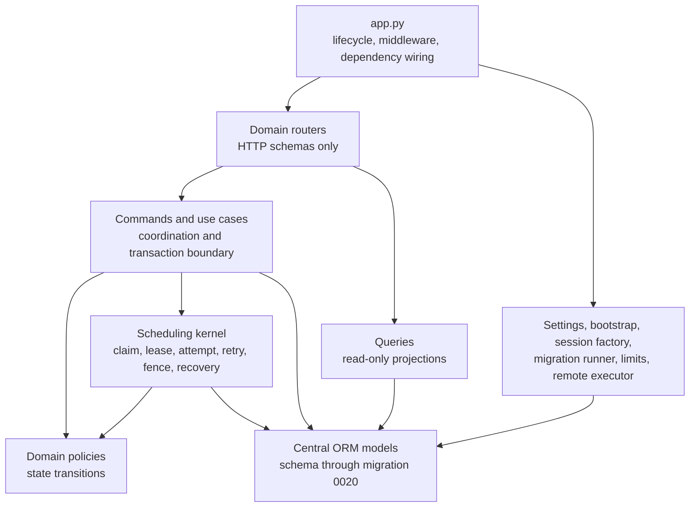

# Control Module Map

Chinese mirror: [control-module-map.zh-CN.md](control-module-map.zh-CN.md)

Status: v0.4.0 RC architecture. Control remains one deployable process, with
explicit application, policy, scheduling, and infrastructure boundaries.

## Runtime Map

`app.py` assembles the process. Routers translate HTTP data. Commands and use
cases own cross-domain coordination and transaction boundaries. Policies own
state transitions. Queries do not mutate. The internal scheduling kernel has no
HTTP router.

## Domain Ownership

| Domain | Owned behavior |
| --- | --- |
| `jobs` | lifecycle, events, logs, counters, and job projections |
| `manifests` | construction, paths, freeze, integrity, and projections |
| `workers` | identity, registration, heartbeat, eligibility, preflight, assignment, and projections |
| `model_profiles` | profile commands, queries, policy, and certification records |
| `scheduling` | shard claim and ordering, lease renewal/reclaim, attempts, retries, fencing, terminal replay, stop, and recovery |
| `diagnostics` | readiness context, bounded metrics, capacity, audit, and alert recommendations |
| `remote_admin` | explicitly enabled remote-worker administration |

The scheduling kernel is the sole owner of `ScanUnit`, `WorkShard`, and
`ShardAttempt` transitions. Worker registration, heartbeat, job stop, and shard
updates coordinate with it through application use cases.

## Transaction Model

- Each mutating command or application use case opens one `session.begin()`.
- A successful command commits once; a failed command rolls back once.
- Leaf mutations may call `flush()` but do not commit or roll back.
- Queries contain no DML and do not commit or roll back.
- Job summary refresh is explicit before the read-only projection is queried.

## Dependency Rules

The v0.4 boundary checks require:

- no private `core` imports across domains;
- no domain dependency cycles;
- no DML in queries;
- no leaf commit or rollback;
- no state assignment outside the owning policy;
- no imports of the removed `ocr_platform.control.service` façade.

ORM models remain centralized in v0.4 to avoid coupling the control-plane
refactor to a schema rewrite. Migrations `0001` through `0020` remain the schema
history.

## Supported Integration Surface

HTTP paths, request and response fields, status codes, database history, and
job/shard/attempt state values remain stable. Explicit domain commands, queries,
and schemas are the supported Python integration surface.

`ocr_platform.control.service` was removed in v0.4. Internal `core`, `policy`,
and `scheduling` module paths are implementation details and are not compatibility
interfaces. See [Control façade migration](control-facade-migration.md) for the
symbol mapping.
