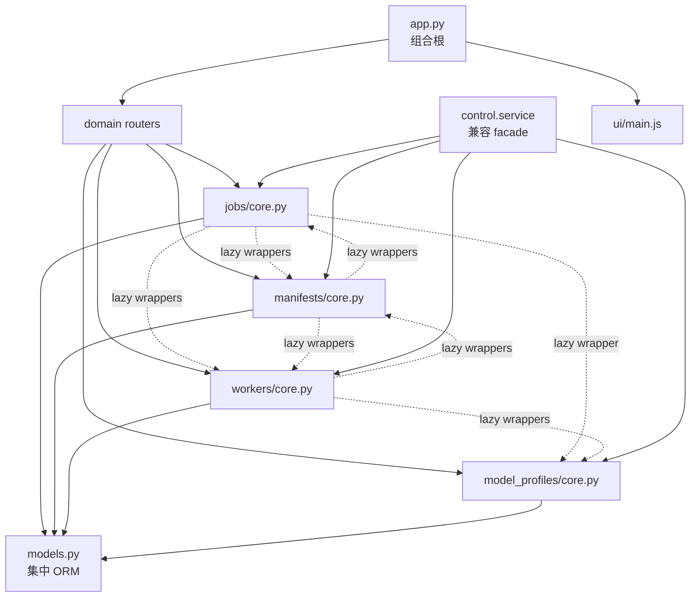
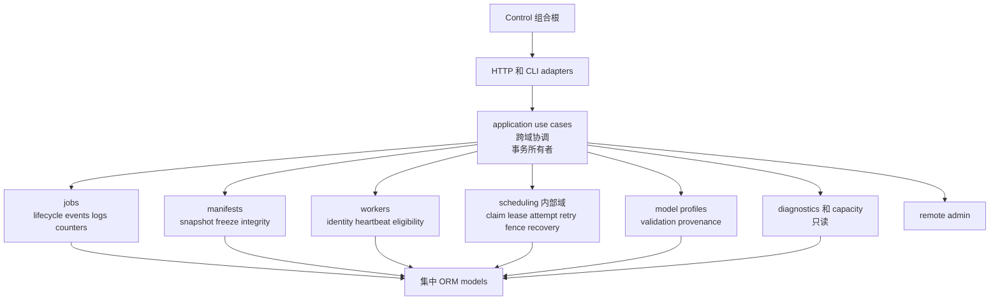

# Control 模块地图

[English](control-module-map.md) | 中文

状态：当前审计快照和 v0.4 目标结构。本文描述所有权和迁移，行数不是验收目标。

相关文档：[Control 内部重构 RFC](rfc-v0.4-control-internals.zh-CN.md)

## 当前结构



## 审计快照

| Surface | 当前证据 | 解释 |
| --- | ---: | --- |
| `app.py` | 138 行 | 已是组合根，不是拆分目标 |
| `jobs/core.py` | 1,678 行 | lifecycle、summary、event、log、counter 和调度协调混合 |
| `manifests/core.py` | 2,100 行 | scan、freeze/integrity、shard 调度、attempt 和 recovery 混合 |
| `workers/core.py` | 1,059 行 | identity、heartbeat、eligibility、preflight、claim、lease 和 recovery 混合 |
| `schemas.py` | 704 行 | 移动前需要锁定共享 schema 兼容 surface |
| `ui/main.js` | 3,268 行 | 记录为债务，不在 Control 内部 RFC 实施 |
| lazy wrapper | 37 | jobs→manifests 8、jobs→workers 7、jobs→profiles 1；manifests→jobs 6、manifests→workers 10；workers→manifests 3、workers→profiles 2 |
| 显式事务点 | 50 | jobs 16、manifests 21、workers 11、model profiles 2 |
| 兼容 façade | 286 个运行时导出 | 动态兼容 surface 很大 |
| façade 消费方 | 8 个测试/工具文件、21 个 monkeypatch | 删除前需要可量化的 symbol 迁移 |
| ORM | 13 个 class | 保持集中 |
| OpenAPI golden | 47 个 path、49 个 operation | 只覆盖数量，尚未锁定完整 schema/status/error contract |

该快照只用于支持边界决策。小文件也可能拥有错误职责，因此减少行数不是成功标准。

## 当前依赖和事务地图

| 区域 | 依赖 | 当前事务行为 | 目标所有者 |
| --- | --- | --- | --- |
| jobs lifecycle | manifests、workers、profiles、ORM | command 和 leaf helper 可能 commit/rollback | jobs application use case |
| job summary | manifests、workers、调度状态 | read path 可能协调状态 | 显式 application refresh，随后 jobs query |
| event/log/counter | jobs ORM 和 pruning policy | mutation 和 pruning 各自持有事务 | jobs command use case |
| manifest setup | jobs、workers、filesystem path | 创建 helper 拥有部分事务 | manifests command use case |
| scan/freeze/integrity | jobs、workers、scan unit | read/mutation 和 worker report 混合 | manifests policy 加 application 协调 |
| shard claim/update | jobs、workers、attempt | claim、lease、retry 和 terminal update 混合 | scheduling command use case |
| worker registration | server 和 scheduling row | restart 可能 fence 运行中任务 | workers registration use case 协调 scheduling |
| heartbeat | server、lease、queue | identity update 和 lease renewal 耦合 | workers heartbeat use case 协调 scheduling |
| job preflight | jobs、workers、profiles、migration status | 以读为主的跨域聚合 | application preflight query |
| model profiles | profile ORM 和环境变量引用 | `GET` list path 可能创建并 commit 默认 profile；共有两个显式事务点 | startup/bootstrap 初始化默认值，随后 model-profile query 只读 |

## 当前有状态实体所有权

| 实体 | 当前行为位置 | 目标 policy owner |
| --- | --- | --- |
| `Job` | jobs，以及 manifests/workers 中的 stop/recovery helper | jobs |
| `JobCounter` | jobs | jobs |
| `JobEvent` | jobs | jobs |
| `JobLog` | jobs | jobs |
| `JobFile` | jobs | jobs |
| `Manifest` | manifests，jobs 中读取 summary | manifests |
| `Server` | workers | workers |
| `ModelProfile` | model profiles，jobs/workers lazy 使用 | model profiles |
| `ScanUnit` | manifests 和 workers | scheduling |
| `WorkShard` | manifests 和 workers | scheduling |
| `ShardAttempt` | manifests 和 workers | scheduling |

## 当前真实功能簇

| 当前文件 | 迁移期间必须保持的真实功能簇 |
| --- | --- |
| `jobs/core.py` | job creation/lifecycle；list 和 summary projection；manifest scan 和 shard progress projection；recent files/errors；stop/archive/delete；event ingestion 和 deduplication；counter 和 pruning；logs |
| `manifests/core.py` | manifest-root inference 和 path check；static shard construction；distributed scan creation；remote manifest registration；scan-unit claim/complete/fail；manifest freeze 和 integrity；worker integrity exchange；shard listing；stop finalization；shard claim/update；attempt listing |
| `workers/core.py` | server registration 和 restart fencing；pool server；heartbeat；lease reconciliation/renewal；effective status 和 count；path access 和 eligibility；migration/auth/version/resource/spool preflight；job/pool claim；archive/list |
| `model_profiles/core.py` | default profile；profile CRUD/validation；仅环境变量 secret resolution；effective job model configuration |
| `control.service` | domain function 的动态 re-export 和兼容 patch surface |

## 目标结构



任何 domain private core 都不能 import 另一个 domain private core。scheduling 不提供
HTTP router。application layer 拥有业务操作事务；leaf mutation policy 只 flush，
query 只读。

## 目标模块树

```text
ocr_platform/control/
  app.py                         # 只负责 lifecycle 和 composition
  settings.py                    # immutable ControlSettings
  bootstrap.py                   # dependency 和 port 装配
  database.py                    # session/engine 构造；无模块级可变 registry
  migration.py                   # migration catalog 和 runner 保留在此
  application/
    jobs.py                      # 跨域 job use case
    workers.py                   # registration/heartbeat use case
    scheduling.py                # claim/update/recovery use case
    preflight.py                 # 跨域 preflight query
  domains/
    jobs/
      commands.py
      queries.py
      transitions.py
      projections.py
      router.py
    manifests/
      commands.py
      queries.py
      integrity.py
      paths.py
      router.py
    workers/
      commands.py
      queries.py
      eligibility.py
      transitions.py
      router.py
    scheduling/
      claims.py
      leases.py
      attempts.py
      recovery.py
      transitions.py
    model_profiles/
      commands.py
      queries.py
      policy.py
      router.py
    diagnostics/
    remote_admin/
  models.py                      # 13 个 ORM class 保持集中
```

这些名称表达方向，不承诺每一项必须创建一个文件。PR 应按所有权和依赖规则评审，
不能机械追求该目录树。
remote executor 由 `bootstrap.py` 通过显式 port 注入，domain module 不自行发现或
构造。`ui/main.js` 的体积继续记录为债务，但不是本 RFC 的退出门禁。

## 迁移地图

| 当前功能簇或 symbol family | 目标位置 | 迁移规则 |
| --- | --- | --- |
| job create/stop/archive/delete | `application.jobs` + jobs transitions | 一个 application transaction |
| summary reconciliation | `application.jobs.refresh_job_summary` | 显式 refresh 后读取；唯一 GET 兼容例外 |
| job summary 和 recent detail | jobs queries/projections | 只读 |
| event/log ingestion、counter、pruning | jobs commands/policies | leaf function 只 flush |
| static/distributed manifest creation | `application.jobs` + manifests commands | jobs 和 manifests 只在 application 协调 |
| path check 和 manifest root | manifests paths + workers eligibility port | 无 private 跨域 import |
| freeze 和 integrity | manifests integrity | 通过显式 port 读取 scheduling state |
| server registration 和 heartbeat | `application.workers` | workers identity 协调 scheduling fence/renew |
| scan-unit claim/complete/fail | scheduling claims/transitions | 无 HTTP router |
| shard claim/update | scheduling claims/transitions | 必须 active-attempt fencing |
| lease expiry/renew/reclaim | scheduling leases/recovery | 唯一 transition policy |
| attempt create/list | scheduling attempts | attempt number 单调 |
| worker/job preflight | `application.preflight` | 只读聚合 |
| model profile initialization | `bootstrap.py` 调用 model-profile command | 显式 startup mutation；list query 改为只读 |
| model profile resolution | model-profile policy | secret value 仍只来自环境变量 |
| façade exports | 显式所属 application/command/query surface | 删除前生成精确旧名到新名 inventory；内部 scheduling module 不作为兼容目标 |

## 边界与验收检查

| 检查 | 必须结果 |
| --- | --- |
| canonical OpenAPI schema/status/error | 不变 |
| migration 和数据库契约 | 0001-0019、table、checksum、constraint 和状态值不变 |
| private core 跨域 import | 0 |
| 循环依赖 | 0 |
| leaf mutation 或 query 中 commit/rollback | 0 |
| query module 中 DML | 0 |
| HTTP `GET`/`HEAD` 中隐藏 DML | 0；兼容迁移期间，显式 DML allowlist 只包含具名的 job-summary `refresh_job_summary` application 调用，移除后为空 |
| owner policy 外的 state assignment | 0，除明确 bootstrap/migration allowlist |
| `control.service` 引用 | 删除前为 0 |
| façade monkeypatch | 删除前为 0 |
| PostgreSQL 行为 | concurrency、reclaim、recovery、late replay、lease 和 attempt fencing 通过 |
| 发布行为 | 全量 CI/安装矩阵、wheel/package data、安全和 AGPL source offer 通过 |

## 迁移顺序

1. 锁定完整 contract，并新增静态边界检查。
2. 先完成运维 auto-migration/readiness、profile、observability、capacity 和 audit。
3. 显式化 settings、session 构造和事务所有权。
4. 建立并验证 scheduling kernel。
5. 使用三个相互独立、可独立回滚的结构 PR 迁移 jobs、manifests 和 workers 功能簇。
6. 按精确 symbol table 迁移全部 façade consumer。
7. 使用独立 PR 删除 façade。

任何结构 PR 都不能同时修改 migration、HTTP contract 或算法。
