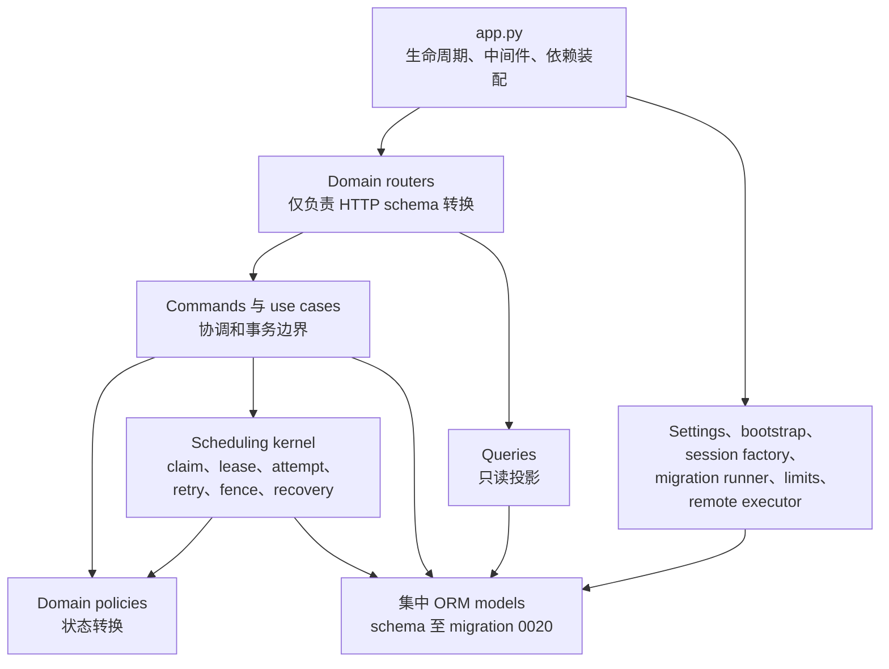

# Control 模块地图

English mirror: [control-module-map.md](control-module-map.md)

状态：v0.4.0 RC 架构。Control 仍以单进程部署，但应用层、策略层、调度内核和基础设施边界已经显式化。

## 运行时地图

`app.py` 负责进程装配；router 只转换 HTTP 数据；command 和 use case 负责跨域协调及事务边界；policy 负责状态转换；query 不产生写入。内部 scheduling kernel 不暴露 HTTP router。

## Domain 所有权

| Domain | 所有行为 |
| --- | --- |
| `jobs` | 生命周期、事件、日志、计数器和 Job 投影 |
| `manifests` | 构造、路径、冻结、完整性和投影 |
| `workers` | 身份、注册、心跳、资格、preflight、分配和投影 |
| `model_profiles` | Profile command、query、policy 和认证记录 |
| `scheduling` | shard claim/排序、lease 续约/回收、attempt、retry、fence、终态 replay、停止和恢复 |
| `diagnostics` | readiness 上下文、有限标签指标、容量、审计和告警建议 |
| `remote_admin` | 需要显式启用的远程 Worker 管理 |

Scheduling kernel 是 `ScanUnit`、`WorkShard` 和 `ShardAttempt` 状态转换的唯一所有者。Worker 注册、心跳、Job 停止和 shard update 通过 application use case 与其协调。

## 事务模型

- 每个写 command 或 application use case 使用一个 `session.begin()`。
- 成功只 commit 一次，失败只 rollback 一次。
- leaf mutation 最多调用 `flush()`，不 commit 或 rollback。
- query 不包含 DML，也不 commit 或 rollback。
- Job summary 先显式 refresh，再执行只读投影查询。

## 依赖规则

v0.4 的边界检查要求：

- domain 之间不导入私有 `core`；
- 不存在 domain 循环依赖；
- query 中不存在 DML；
- leaf 中不存在 commit/rollback；
- 状态赋值不越过 owning policy；
- 不再导入已删除的 `ocr_platform.control.service` façade。

v0.4 继续集中维护 ORM models，避免把 Control 重构与 schema 重写耦合。数据库历史保持 migration `0001` 至 `0020`。

## 支持的集成面

HTTP 路径、请求响应字段、状态码、数据库历史和 Job/Shard/Attempt 状态值保持稳定。显式 domain commands、queries 和 schemas 是支持的 Python 集成面。

`ocr_platform.control.service` 已在 v0.4 删除。内部 `core`、`policy` 和 `scheduling` 路径属于实现细节，不承诺兼容。旧 symbol 的迁移方式见 [Control façade 迁移](control-facade-migration.zh-CN.md)。
